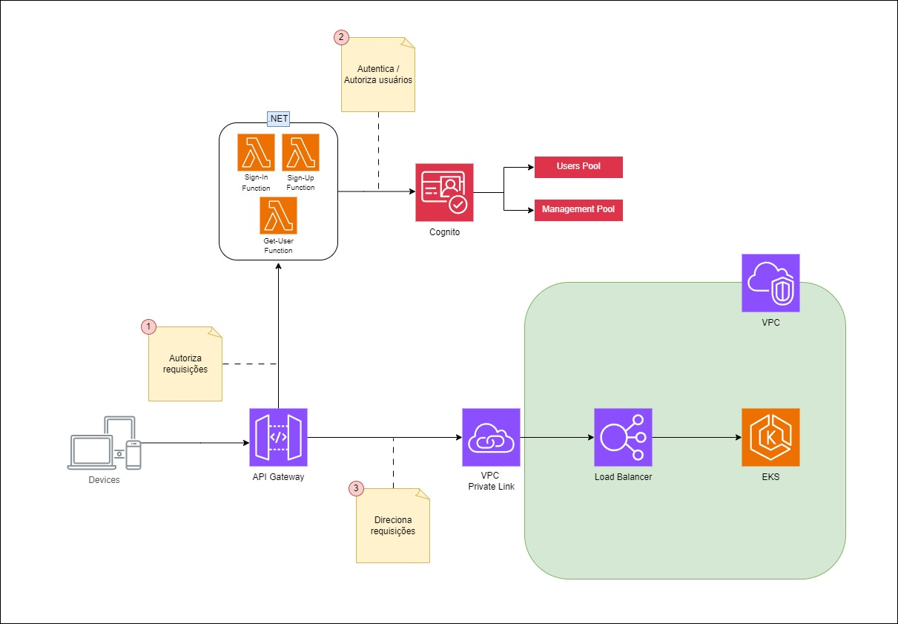

# 🔑 Dotlanche Authentication

Repositório para gerenciamento da infraestrutura de autenticação e autorização da Dotlanches. 
Contém scripts terraform para criação da infraestrutura e o código das Lambda Functions..

# ⚡ Functions

O repositório contém 3 Lambda Functions da AWS em dotnet que foram construídas utilizando [Annotations do SDK .NET](https://docs.aws.amazon.com/sdk-for-net/v3/developer-guide/aws-lambda-annotations.html). Essas funcões ativadas por chamadas HTTP e são responsáveis pelo processo de autenticação e autorização dos usuários integrando com o [AWS Cognito](https://aws.amazon.com/pt/pm/cognito).

**As Functions existentes são:**

- **Get User**: Permite que usuários se identifiquem através do seu CPF, buscando os usuários cadastrados no cognito.
- **Sign Up**: Permite que usuários se cadastrem enviando suas informações básicas como CPF, Nome, email e senha.
- **Sign In**: Realiza a autenticação do usuário através de CPF e senha, retorna o token JWT para a autorização no API Gateway. Também permite a geração de token anônimo caso o usuário não queira se identificar.

# 🛠 Infraestrutura

A infraestrutura é provisionada através de IaC (infrastructure as code) utilizando [Terraform](https://www.terraform.io/) para publicar na AWS. Esses scripts estão sendo executados de maneira automática no pipeline do repositório através de [Github Actions](https://docs.github.com/pt/actions/about-github-actions/understanding-github-actions).

## Infraestrutura Gerenciada:

- **AWS Cognito**
    - Users user Pool, client
    - Management user Pool, client
    - Usuários padrão e default
- **AWS Lambda Functions**
    - Get User
    - Sign In
    - Sign Up
- **AWS API Gateway**
    - Routes
    - Integrations com functions e com vpc private link
    - Autorizers dos pools user e management
    - VPC Link para VPC que contém o EKS
- **Load Balancer**
    - Listener
    - Target Group para os nós do cluster EKS dotcluster
